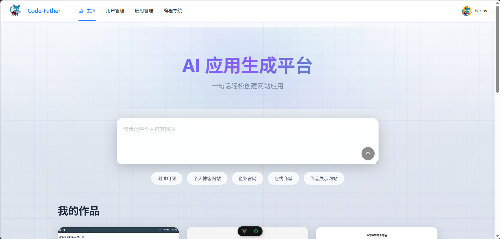
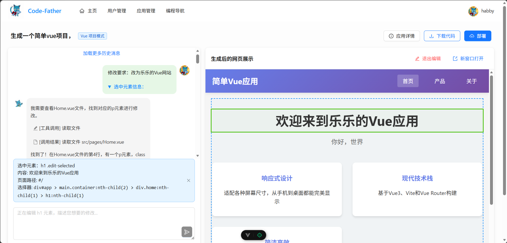
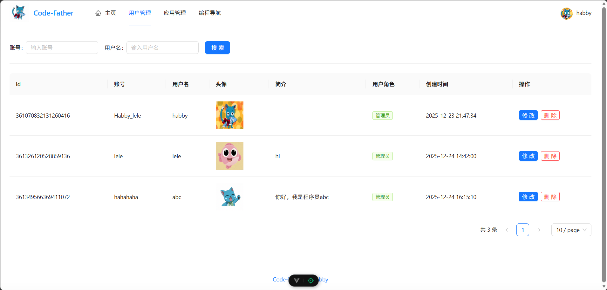

# Code-Father

Code-Father 是一个 AI 代码生成平台，前端负责交互和实时预览，后端负责应用创建、对话生成、代码落盘、部署和管理能力。

整体体验比较直接：输入一句需求创建应用，在对话页持续和 AI 沟通，右侧实时看效果，改到满意后可以下载代码或一键部署。

## 项目预览

### 首页



### 对话生成与可视化修改



### 后台管理



## 项目能做什么

- 一句话创建网站应用
- 对话式继续修改生成结果
- 右侧实时预览网页效果
- 支持可视化选中页面元素后再让 AI 定向修改
- 支持下载源码、部署应用、分享访问地址
- 提供用户、应用、对话等后台管理能力
- 提供 Prometheus 和 Grafana 的监控配置

## 项目结构

| 模块 | 目录 | 说明 |
| --- | --- | --- |
| 后端 | `src/` | Spring Boot 服务，负责用户、应用、对话、AI 编排、部署和监控 |
| 前端 | `code-father-frontend/` | Vue 3 前端，负责页面交互、对话区、预览区和后台页面 |
| 数据库脚本 | `sql/` | 初始化表结构脚本 |
| 监控配置 | `prometheus/`、`grafana/` | 指标采集与仪表盘配置 |
| 项目预览图 | `preview/` | README 使用的页面展示图 |

## 技术栈

### 后端

- Spring Boot 3
- LangChain4j
- LangGraph4j
- MyBatis-Flex
- MySQL
- Redis
- Selenium
- Prometheus + Grafana

### 前端

- Vue 3
- TypeScript
- Vite
- Pinia
- Vue Router
- Ant Design Vue

## 快速启动

### 环境准备

- JDK 21
- Maven
- Node.js
- MySQL
- Redis

### 1. 初始化数据库

执行：

```sql
sql/create_table.sql
```

### 2. 启动后端

后端默认配置在 `src/main/resources/application.yml`，本地开发至少需要准备：

- MySQL
- Redis
- AI 模型 Key
- 对象存储相关配置（如果要用部署和封面能力）

启动命令：

```bash
mvn spring-boot:run
```

默认接口地址：

```text
http://localhost:8123/api
```

### 3. 启动前端

进入前端目录：

```bash
cd code-father-frontend
npm install
```

在前端目录创建 `.env.local`：

```bash
VITE_DEPLOY_DOMAIN=http://localhost
VITE_API_BASE_URL=http://localhost:8123/api
```

启动前端：

```bash
npm run dev
```

## 核心模块一眼看懂

- 前端首页：输入提示词创建应用，同时展示我的作品和精选案例
- 对话页：左侧保留对话历史，右侧展示生成后的网页，可继续编辑、下载、部署
- 可视化编辑：先选中页面元素，再描述修改要求，适合做局部调整
- 后端 AI 编排：根据生成类型路由不同策略，支持流式输出和项目构建
- 管理后台：管理员可以查看用户、应用和对话记录
- 监控：后端暴露 Prometheus 指标，仓库里已经放了 Grafana 仪表盘配置

## 补充说明

- 这个仓库是完整项目仓库，不是只有前端或只有后端。
- 如果只启动前端，会缺少创建应用、对话生成、部署、下载等核心能力。
- 如果只想快速了解前端部分，可以继续看 [code-father-frontend/README.md](code-father-frontend/README.md)。
