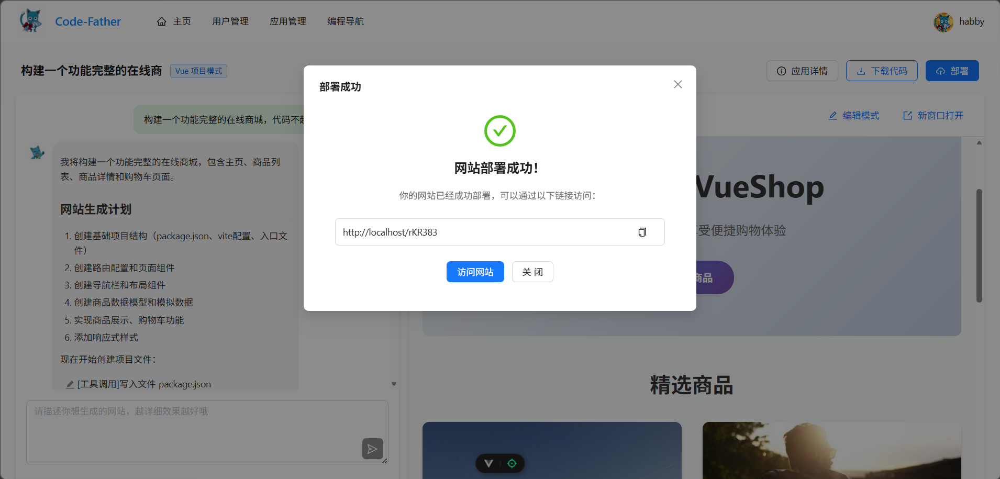

# Code-Father Frontend

`code-father-frontend` 是 Code-Father AI 应用生成平台的前端项目，基于 Vue 3、TypeScript 和 Ant Design Vue 开发。

它的核心体验很直接：用户输入一句需求，系统创建应用，对话式继续修改，右侧实时预览生成结果，满意后可以下载代码或一键部署。

## 项目预览

### 首页


### 对话生成与部署



### 后台管理


## 这个项目能做什么

- 通过一句提示词创建网站应用
- 在对话页持续和 AI 交流，边改边看预览
- 支持下载生成代码、部署应用
- 支持查看我的作品和精选案例
- 提供管理员侧的用户、应用、对话管理能力

## 主要页面

| 页面 | 路径 | 说明 |
| --- | --- | --- |
| 首页 | `/` | 输入需求、创建应用、查看我的作品和精选案例 |
| 应用对话页 | `/app/chat/:id` | 左侧对话，右侧实时预览，支持部署和下载代码 |
| 应用编辑页 | `/app/edit/:id` | 修改应用名称，管理员可额外编辑封面和优先级 |
| 应用管理页 | `/admin/appManage` | 管理员查看、搜索、编辑、删除应用 |
| 对话管理页 | `/admin/chatManage` | 管理员查看应用对话记录 |
| 用户相关页面 | `/user/login`、`/user/register`、`/user/edit` | 登录、注册和个人信息维护 |

## 技术栈

- Vue 3
- TypeScript
- Vite
- Pinia
- Vue Router
- Ant Design Vue
- Axios

## 快速启动

### 1. 安装依赖

```bash
npm install
```

### 2. 配置环境变量

在项目根目录新建 `.env.local`，最少配置下面两个变量：

```bash
VITE_DEPLOY_DOMAIN=http://localhost
VITE_API_BASE_URL=http://localhost:8123/api
```

### 3. 启动开发环境

```bash
npm run dev
```

### 4. 常用命令

```bash
npm run build
npm run type-check
npm run lint
```

## 目录结构

```text
src/
├── api/          # 接口请求
├── components/   # 通用组件
├── config/       # 环境配置
├── layouts/      # 页面布局
├── pages/        # 页面
├── router/       # 路由
├── stores/       # 状态管理
├── utils/        # 工具方法
└── main.ts       # 入口文件
```

## 补充说明

- 这个前端项目依赖后端接口，单独启动后只能看到界面，完整功能需要配合后端服务。
- 预览、对话生成、下载代码、部署能力都依赖后端对应接口。
- 如果你只是想快速了解项目，建议先看 `src/pages/HomePage.vue` 和 `src/pages/app/AppChatPage.vue`。
